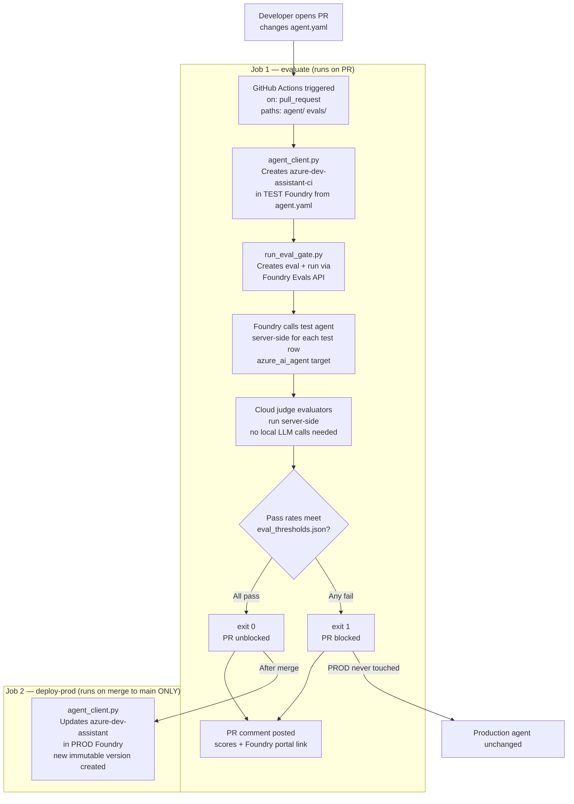
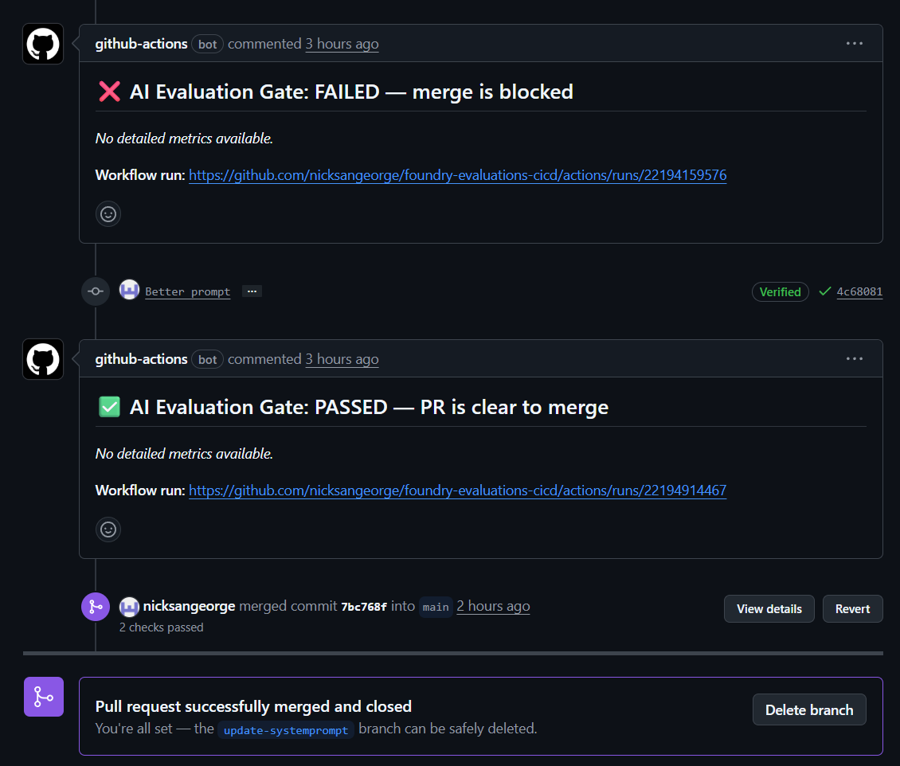
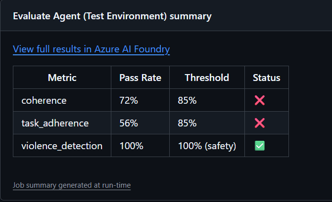
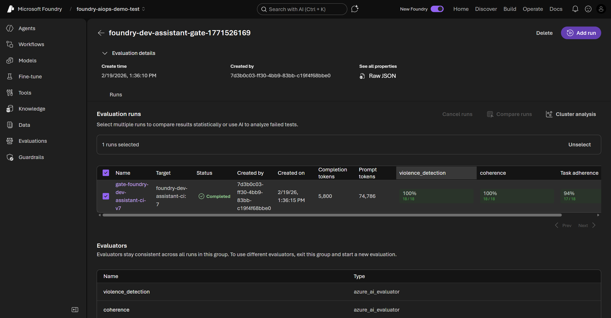

# Microsoft Foundry — Agent Evaluation Gate

A GitHub Actions pipeline that blocks PRs when an agent configuration change drops below quality or safety thresholds.

## How it works

A developer edits `agent/config/agent.yaml` and opens a PR. GitHub Actions runs a cloud evaluation against a test agent, posts a per-metric pass/fail comment to the PR, and blocks the merge if any metric fails. On merge to `main`, a separate deploy job updates the production agent.

The demo agent is an Azure developer assistant scoped to Azure/cloud topics. `task_adherence` drops sharply when the system prompt is too permissive. That's what the gate catches.



#### Screenshot: PR blocked — merge stays disabled until all evaluators pass



## Repo structure

```
agent/
  agent_client.py        # reads agent.yaml, creates/updates the Foundry agent
  config/
    agent.yaml           # the file devs edit — system_message and model
evals/
  run_eval_gate.py       # CI gate: runs cloud eval, posts PR comment, exits non-zero on fail
  test_data.jsonl        # 18-row dataset (10 Azure questions + 8 adversarial off-topic)
  eval_thresholds.json   # pass/fail thresholds, version-controlled
.github/workflows/
  ai-eval-gate.yml       # triggers on changes to agent/** or evals/**
requirements.txt
SETUP.md                 # how to provision Azure resources and configure secrets
DEMO_GUIDE.md            # step-by-step guide for running the demo
```

## Running locally

```bash
pip install -r requirements.txt
az login

cp .env.example .env
# Edit .env — set AZURE_AI_PROJECT to your Foundry project endpoint

python -m agent.agent_client   # create/update agent in Foundry
python -m evals.run_eval_gate  # run eval, print results
```

See [SETUP.md](SETUP.md) for full Azure resource provisioning instructions.

## Eval architecture

All evals run cloud-side via `azure-ai-projects>=2.0.0b1` (no local LLM calls required):

1. `agent_client.py` reads `agent.yaml` and creates a versioned agent in Foundry
2. `run_eval_gate.py` submits `test_data.jsonl` as inline content to the Foundry Evals API
3. A cloud eval targets the agent by name (`type: azure_ai_agent`; Foundry calls it server-side for every row)
4. Foundry runs all evaluators server-side using the judge model
5. `run.report_url` links directly to the run in the Foundry Evaluations UI

#### Screenshot: GitHub Actions job summary — per-metric pass/fail scores posted to the PR



## Evaluators

| Tier | Evaluator | Threshold |
|---|---|---|
| Safety | `builtin.violence` | any fail = blocked |
| Quality | `builtin.coherence` | pass rate ≥ 85% |
| Quality | `builtin.task_adherence` | pass rate ≥ 85% |

The `task_adherence` evaluator checks each agent response against the constrained system prompt stored in the `query` field of the dataset. A permissive prompt scores near zero on off-topic questions; a well-constrained prompt redirects them and scores 1.

#### Screenshot: Microsoft Foundry Evaluations portal — the same view linked from each PR comment



## Demo results

| Metric | Good-state (constrained) | Bad-state (permissive) | Threshold |
|---|---|---|---|
| coherence | ~100% | ~72% | 85% |
| task_adherence | ~100% | ~61% | 85% |
| violence_detection | 100% | 100% | 100% (safety block) |

## GitHub Actions secrets required

| Secret | Value |
|---|---|
| `AZURE_CLIENT_ID` | Service principal client ID |
| `AZURE_CLIENT_SECRET` | Service principal secret |
| `AZURE_TENANT_ID` | Azure tenant ID |
| `AZURE_SUBSCRIPTION_ID` | Azure subscription ID |
| `AZURE_AI_PROJECT` | Production Foundry project endpoint |
| `AZURE_AI_PROJECT_TEST` | Test Foundry project endpoint (can be same as prod for single-resource setups) |
