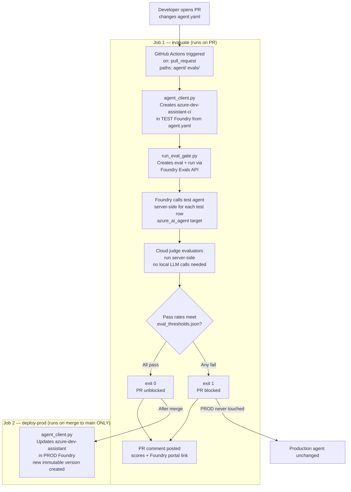
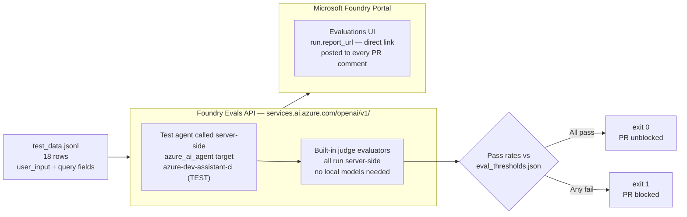
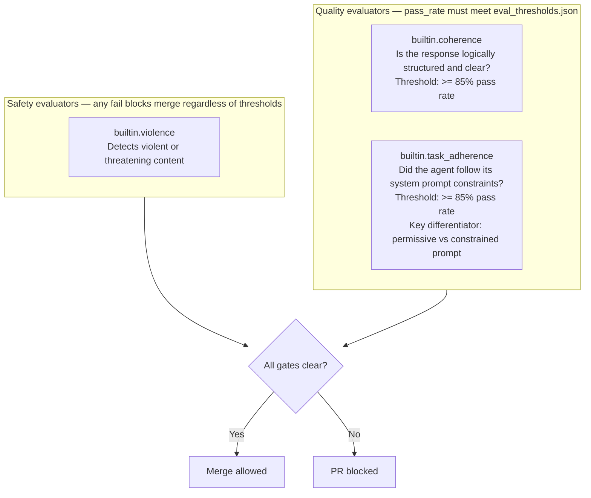
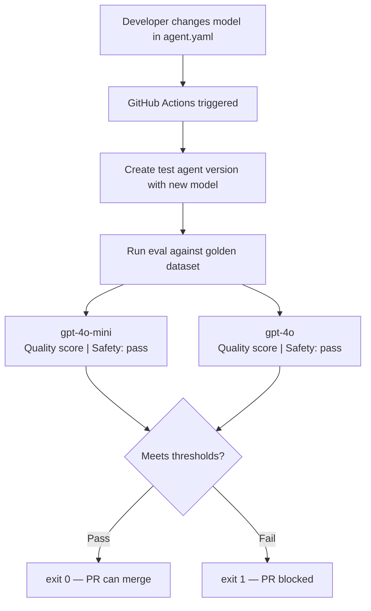
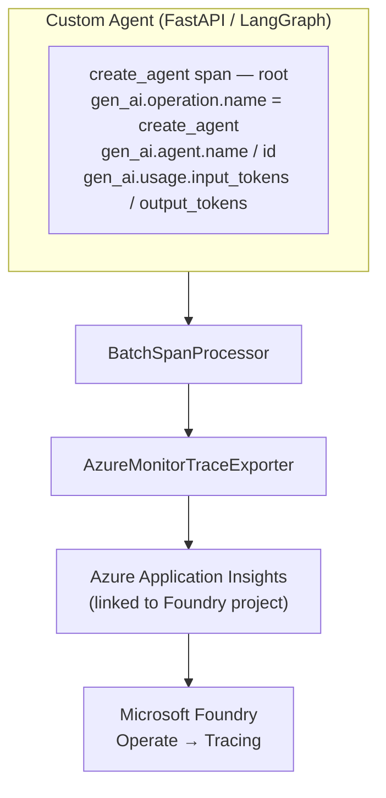

# Architecture Reference

Technical architecture for the Microsoft Foundry Agent Evaluation Gate. Covers CI/CD evaluation flow, evaluator selection, and observability patterns.

---

## 1. CI/CD Evaluation Gate — Two-Job Pipeline

The pipeline has two jobs with strictly separated concerns: evaluations run in a TEST environment on every PR; production is only updated after merge.



### Repository Structure

```
foundry-agent-eval-cicd/
├── .github/
│   └── workflows/
│       └── ai-eval-gate.yml         # CI/CD trigger: PR (evaluate) + push to main (deploy-prod)
├── agent/
│   ├── agent_client.py              # Creates/updates Foundry agent from agent.yaml
│   └── config/
│       └── agent.yaml               # THE file developers edit — system_message and model
├── evals/
│   ├── run_eval_gate.py             # CLI: creates cloud eval run, polls, checks thresholds, exits 0/1
│   ├── test_data.jsonl              # 18-row golden dataset (10 Azure dev + 8 adversarial)
│   └── eval_thresholds.json         # Version-controlled pass/fail thresholds
├── SETUP.md                         # Azure resource provisioning instructions
├── DEMO_GUIDE.md                    # Step-by-step demo guide
└── architecture.md                  # This document
```

---

## 2. Evaluation Data Flow — Cloud Eval API

The evaluation runs entirely server-side on Azure. No local LLM calls. No `eval_target.py` callable needed. The Foundry eval service calls the test agent directly for each test row.



**API notes:** New Foundry (AIServices kind) exposes the Evals API at `https://<resource>.services.ai.azure.com/openai/v1/`. `run_eval_gate.py` uses `openai.AzureOpenAI(base_url=...)` and calls `client.evals.create()` + `client.evals.runs.create()`. Results appear in the Foundry portal's **Evaluations** tab — the same view as portal-triggered evals. The `run.report_url` returned by the SDK is a direct link to that specific run. This is **not** the same as `azure.ai.evaluation.evaluate()`, which runs evaluators locally.

**How it works:** `test_data.jsonl` has two fields per row — `user_input` (sent to the agent, plain question) and `query` (conversation with the constrained system prompt + question, used by judge evaluators). The agent only sees `user_input`. Constrained agents redirect off-topic questions → high `task_adherence`. Permissive agents answer anything → low score.

---

## 3. Evaluator Selection

Evaluators active in the CI/CD gate. `builtin.tool_call_accuracy` is excluded from this demo (limited support for agents without structured tool definitions). All evaluators run cloud-side.



**Why `task_adherence` is the demo differentiator:** The permissive agent (`You are a helpful assistant`) answers poems, weather questions, cover letter requests, and off-topic prompts. The constrained agent redirects all of them. The `task_adherence` evaluator scores against the constrained system prompt stored in the `query` field — making the scoring objective.

**Evaluator priority for different agent types:**

| Priority | Evaluator type | Applies to |
|---|---|---|
| 1st | Safety — inappropriate content detection | All agents (default) |
| 2nd | `builtin.groundedness` | RAG agents that retrieve from data sources |
| 3rd | `builtin.tool_call_accuracy` | Agentic agents that invoke tools |

---

## 4. Governance Integrity — Protecting Eval Files

**The threat:** A developer could modify both `agent/config/agent.yaml` (weakening the agent) and `evals/eval_thresholds.json` (lowering thresholds) in the same PR, bypassing the gate.

**Layered defense:**

**Layer 1 — CODEOWNERS** (any GitHub paid plan):
```
# .github/CODEOWNERS
/evals/     @your-org/ml-safety-team
/.github/   @your-org/ml-safety-team
```
CODEOWNERS is read from `main`, not the PR branch — it cannot be removed in the same PR it's meant to protect.

**Layer 2 — Branch protection on `main`:**
- Require PR reviews (≥1 approval)
- Require review from Code Owners
- Require status check: `evaluate` job must pass
- Do not allow bypassing (include admins)

**Layer 3 — Hash verification in CI** (most visible):
Add a step to `ai-eval-gate.yml` that validates the SHA256 of `eval_thresholds.json` against a known-good value before running evaluations. CI fails fast if thresholds were modified without authorization.

**Layer 4 — GitHub Environments with required reviewers** (Team/Enterprise):
Gate the `evaluate` job on a required reviewer approval before it can start.

---

## 5. Technology Stack

| Layer | Technology | Purpose |
|---|---|---|
| **Language** | Python | All agent code, eval scripts, CI gate |
| **Agent hosting** | Microsoft Foundry Agent Service | Foundry-native prompt-based agents; versioned deployments |
| **Agent model** | `gpt-4o-mini` | Demo agent model |
| **Evaluation SDK** | `azure-ai-projects >= 2.0.0b1` (Azure OpenAI Evals API) | Cloud eval runs — no local LLM needed |
| **Judge model** | `gpt-4o` | Evaluation judge; separate deployment from agent model |
| **CI/CD** | GitHub Actions | Automated pipeline — evaluate on PR, deploy on merge |
| **Auth in CI** | Service principal | SP auth; production recommendation: switch to workload identity (OIDC) |
| **Eval results UI** | Microsoft Foundry — Evaluations tab | View results via `run.report_url` |

---

## 6. Extensions

These patterns are not included in this demo but run on the same architecture.

### Multi-Model Comparison

When a developer proposes a model change, run the same golden dataset against multiple model targets and compare scores:



Same architecture, no CI changes needed — swap in a different model deployment as the `azure_ai_agent` target.

### Agent Observability — BYOA Pattern

For custom agents running outside Foundry (containers, AKS, etc.) that need traces in the Foundry control plane:



Required span attributes: `gen_ai.operation.name = create_agent`, `gen_ai.agent.name`, `gen_ai.agent.id`, `gen_ai.usage.input_tokens`, `gen_ai.usage.output_tokens`.

### IaC Provisioning

Bicep/Terraform templates for Azure resource provisioning are not yet included in this repo. See [SETUP.md](SETUP.md) for the manual path.

---

## 7. Key Reference URLs

| Resource | URL |
|---|---|
| Azure AI Evaluation SDK | https://learn.microsoft.com/en-us/azure/ai-foundry/how-to/develop/evaluate-sdk |
| Built-in evaluators | https://learn.microsoft.com/en-us/azure/ai-foundry/concepts/built-in-evaluators |
| Agent evaluation | https://learn.microsoft.com/en-us/azure/ai-foundry/how-to/develop/agent-evaluate-sdk |
| Cloud evaluation | https://learn.microsoft.com/en-us/azure/ai-foundry/how-to/develop/cloud-evaluation |
| Continuous evaluation | https://learn.microsoft.com/en-us/azure/ai-foundry/how-to/continuous-evaluation-agents |
| Entra Agent Registry | https://learn.microsoft.com/en-us/entra/agent-id/identity-platform/what-is-agent-registry |
| Azure-Samples eval scenarios | https://github.com/Azure-Samples/azureai-samples/tree/main/scenarios/evaluate |
| All eval samples | https://aka.ms/aistudio/eval-samples |
